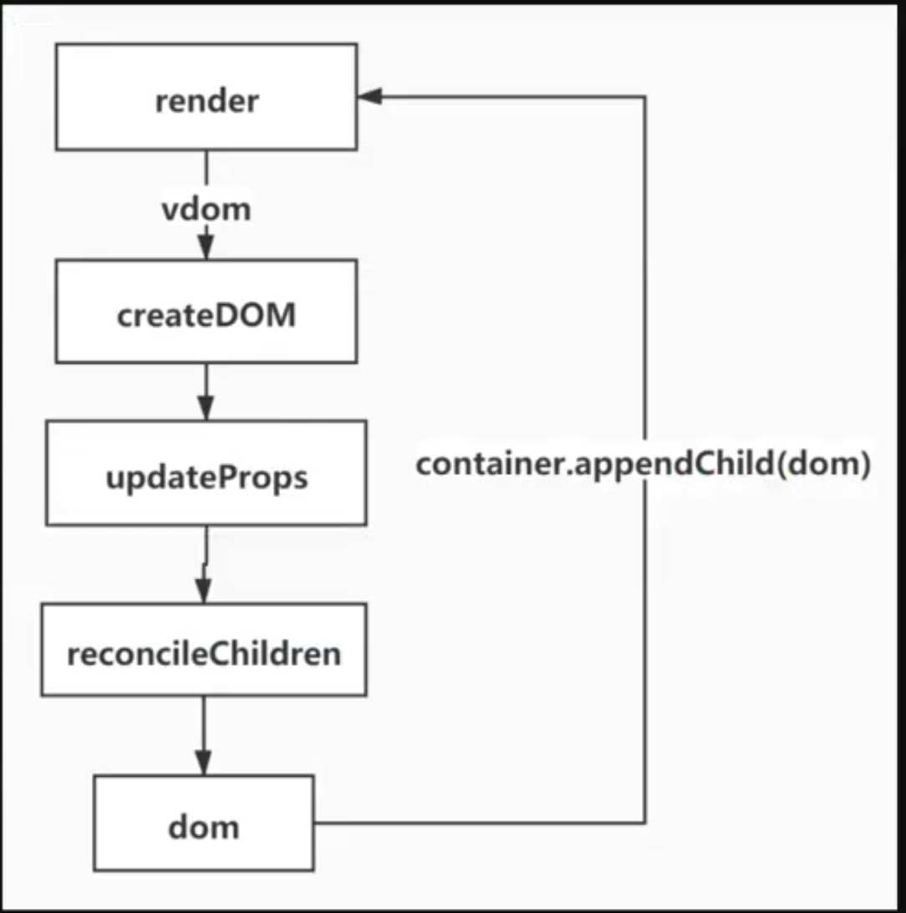

# 渲染

[babel 编辑](https://www.babeljs.cn/repl#?browsers=defaults%2C%20not%20ie%2011%2C%20not%20ie_mob%2011&build=&builtIns=false&corejs=3.6&spec=false&loose=false&code_lz=DwCwjAfGBMDMwHpwSA&debug=false&forceAllTransforms=false&shippedProposals=false&circleciRepo=&evaluate=false&fileSize=false&timeTravel=false&sourceType=module&lineWrap=true&presets=env%2Creact%2Cstage-2&prettier=false&targets=&version=7.14.7&externalPlugins=)


# 第一步

DISABLE_NEW_JSX_TRANSFORM=true 不使用react的React.createElement()

```json
{
  "scripts": {
    "start": "set DISABLE_NEW_JSX_TRANSFORM=true&&react-scripts start",
  }
}
```

# 函数组件

1. 可以将 UI 切分成一些独立的、可复用的部件、这样你就只需专注与构建每一个单独的部件
2. 组件从概念上类似与 JavaScript 函数。它接受任意的入参(props)，并返回用于描述页面展示内容的 React 元素
3. 函数组件接受单一的 props 对象并返回一个 React 元素

# class 组件
更新